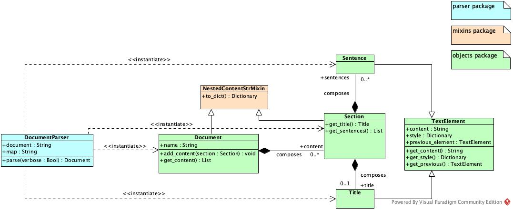
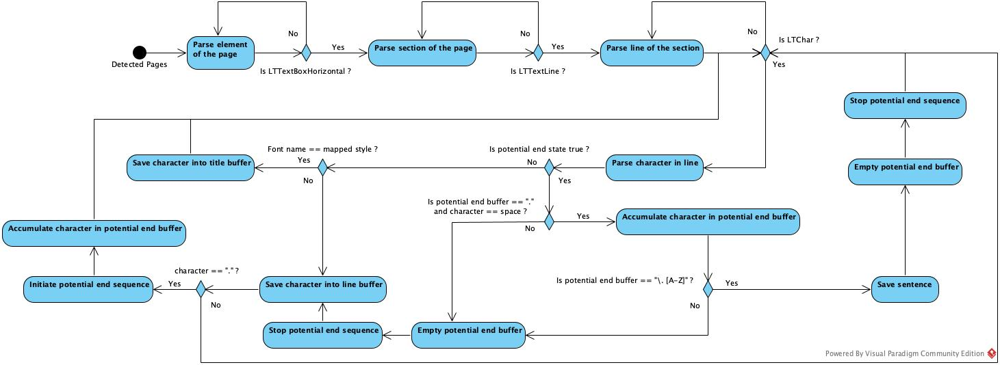

# REPLICA Automated Document Analysis Tool

This repository contains the tool used for automated document analysis developed
by the PET Lab at the University of Lausanne. This tool is used in the context
of the REPLICA project.

## Installing REPLICA
Replica is developed using the Python language and is primarly designed for Python 3.9
(other versions, as long as in Python 3.X might work). You will need to have Python
installed on the machine where you want to run this tool.

### Importing the dependencies
In order to run the tool, you will need to download and install some required libraries.
To do so, we recommend creating a Python virtual environment. For the remainder of these
instructions we will assume that we are in the tool's folder. Thus, start by creating
the virtual environment as suggested in this command:
```
$ python -m venv ./venv
```
This command will create a virtual environment nammed *venv* in your current repository.
Then, activate your environment and import the required dependencies, using the following
command:
```
$ source ./venv/bin/activate
$ pip install -r requirements.txt
```
If everything went smoothly, you are all set to start using the tool.

### Creating the mappings
Mappings are definitions of elements' types and their respective style. In the current
version, this is only used to detect the title. In the future versions, the mappings will
let you detect other types of content that uses a specific font name. A mapping looks
like the one below (CHI '17 style), and is stored in a JSON file:
```
[
  {
    "style": "UMWZPN+Arial-BoldMT",
    "type": "title"
  }
]
```
We did a manual analysis of the font name used in order to determine the CHI '17 style
and the CHI '22. However, the next version will have an exploration command that
will make a summary of the styles detected.

## Using REPLICA
Using the tool is pretty simple. The tool offers the following options:
```
$ python main.py -h
usage: main.py [-h] [-v] [-in INPUT] [-o OUTPUT] [-m MAP]

optional arguments:
  -h, --help            show this help message and exit
  -v, --verbose         Use this if you want the program to yell what it is doing
  -in INPUT, --input INPUT
                        Input content to parse, if it is a folder all its contentwill be parsed
  -o OUTPUT, --output OUTPUT
                        The output path to store the content eventually generated
  -m MAP, --map MAP     The style map file to use to recognise the content
```
There are two mandatory parameters to provide in order to make the tool work. First you have
to provide the input file or folder path. Second, the mapping file to use. If you 
specify an output folder, the tool will output the parsed documents in it.  
Thus, you can use the following command to parse the CHI '17 documents and get
an output:
```
$ python main.py -in content/2017/ -m maps/map_2017.json -o output/
```

## Understanding the parsing mechanism
The tool has a set of classes that define: a document, a section, a title, and a sentence.
We provide a view of the architecture through the following figure,
representing the class diagram of the parsing elements.


Together with this architecture, we use a specific mechanism to detect
the sentences and their ends.   
**Be aware that currently the system is not
optimized and there might be some changes in the detection. However, the
structure you get will always be the same.**   
We provide further details
on the parsing of the documents through the following activity diagram.

