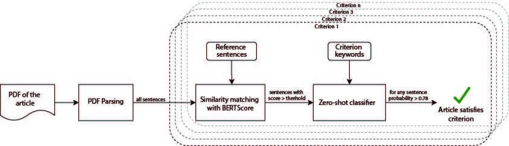

# REPLICA Criteria Screening Tool

<!-- @import "[TOC]" {cmd="toc" depthFrom=1 depthTo=6 orderedList=false} -->

<!-- code_chunk_output -->

- [REPLICA Automated Criteria Screening Tool](#replica-automated-criteria-screening-tool)
  - [Installing REPLICA](#installing-replica)
    - [Importing the dependencies](#importing-the-dependencies)
  - [Architecture of the proof-of-concept screening tool](#architecture-of-the-proof-of-concept-screening-tool)
  - [PDF Parsing](#pdf-parsing)
    - [Creating the mappings](#creating-the-mappings)
    - [Using the parser](#using-the-parser)
    - [Understanding the parsing mechanism](#understanding-the-parsing-mechanism)
  - [Criteria Screening](#criteria-screening)
    - [Using the criteria screener](#using-the-criteria-screener)
    - [Screening large number of PDFs](#screening-large-number-of-pdfs)
  - [Citation](#citation)
  - [Acknowledgements](#acknowledgement)

<!-- /code_chunk_output -->


This repository contains the code used for a proof-of-concept screening tool developed
by the PET Lab at the University of Lausanne. This tool is used in the context
of the REPLICA project. The CHI 2023 paper can be found here (TBA). This tool detects whether the text from a PDF of an article
meets a criterion.

## Installing REPLICA
Replica is developed using the Python language and is primarly designed for Python 3.9
(other versions, as long as in Python 3.X might work). You will need to have Python
installed on the machine where you want to run this tool.

### Importing the dependencies
In order to run the tool, you will need to download and install some required libraries.
To do so, we recommend creating a Python virtual environment. For the remainder of these
instructions we will assume that we are in the tool's folder. Thus, start by creating
the virtual environment as suggested in this command:
```
$ python -m venv ./venv
```
This command will create a virtual environment nammed *venv* in your current repository.
Then, activate your environment and import the required dependencies, using the following
command:
```
$ source ./venv/bin/activate
$ pip install -r requirements.txt
```
If everything went smoothly, you are all set to start using the tool.

## Architecture of the proof-of-concept screening tool


## PDF Parsing
This step involves preprocessing the PDF files of the articles to extract the content from it.

### Creating the mappings
Mappings are definitions of elements' types and their respective style. 
Below is an example of a mapping:
```
[
  {
    "style": "UMWZPN+Arial-BoldMT",
    "type": "title"
  }
]
```
We currently use mappings from the style only to detect the title of the paper.

### Using the parser
The parser offers the following options:
```
$ python parser.py -h
usage: parser.py [-h] [-v] [-in INPUT] [-o OUTPUT] [-m MAP]

optional arguments:
  -h, --help            show this help message and exit
  -v, --verbose         Use this if you want the program to yell what it is doing
  -in INPUT, --input INPUT
                        Input content to parse, if it is a folder all its content will be parsed
  -o OUTPUT, --output OUTPUT
                        The output path to store the content eventually generated
  -m MAP, --map MAP     The style map file to use to recognise the content
```
There are two mandatory parameters to provide in order to make the tool work. First you have
to provide a paper PDF file (or a path containing PDF files) as input. Second, the mapping file to use. If you 
specify an output folder, the tool will output the parsed documents in it.  
Thus, you can use the following command to parse the CHI '17 documents and get
an output:
```
$ python parser.py -in content/2017/ -m maps/map_2017.json -o output/
```

### Understanding the parsing mechanism
The tool has a set of classes that define: a document, a section, a title, and a sentence.
We provide a view of the architecture through the following figure,
representing the class diagram of the parsing elements.


Together with this architecture, we use a specific mechanism to detect
the sentences and their ends.   
**Be aware that currently the system is not
optimized and there might be some changes in the detection. However, the
structure you get will always be the same.**   
We provide further details
on the parsing of the documents through the following activity diagram.


## Criteria Screening
This implements a proof-of-concept system that detects if each sentence satisfies a criterion. 
After preprocessing the PDF into a set of individual sentences, each sentence is 
independently analyzed in two steps: 
First, we use [BERTScore](https://github.com/Tiiiger/bert_score) to calculate how similar the input sentence is with any reference sentences. 
Second, for each sentence that is adequately similar, 
we use NLI based zero-shot classification to determine the probability that the sentence could be *entailed* by each of the criterion’s keywords. 
The input sentences that pass both tests are positive prediction. 
Any paper with a positive sentence is classified as satisfying the criterion.

### Using the criteria screener
The screener offers the following options:
```
$ python criteria_screener.py -h
usage: criteria_screener.py [-h] [-f FILEPATH] [-o OUTPUT] [-s] [-c]

optional arguments:
  -h, --help            show this help message and exit
  -f FILEPATH, --filepath FILEPATH
                        The path containing the output of the PDF parser
  -o OUTPUT, --output OUTPUT
                        The output path to store the predictions, stores in output/ by default
  -ns, --no_similarity  Disables BERTScore similarity matching to filter sentences
  -nc, --no_classifier  Disables zero-shot text classifier
```

The input filepath is a mandatory parameter. 
This should ideally be the output folder from the parser. 
You can choose to use the similarity filter or the zero-shot text classifier or both while determining if the sentence satisfies the criterion. 
Using both the options optimizes to give high F1 scores and hence is used in the REPLICA paper. By default, both are set to be True
Thus, the command to obtain predictions for the parsed PDFs in ```output/```:


```
python criteria_screener.py -f output/
```

The output is stored in the form of a predictions.csv file where each row contains the prediction for one article for all the criteria checked.
Another outout file called sentences.csv is also stored which gives details on the sentences evaluated for an article and their respective scores.

The reference sentences for each criterion used for similarity filtering is present in [criteria_groundtruth.json](util_files/criteria_goundtruth.json).
The threshold hyperparameter for each criterion used for similarity filtering is present in [threshold_scores.json](util_files/threshold_scores.json).
The labels used for zero-shot classifier is also present in [criteria_groundtruth.json](util_files/criteria_goundtruth.json) under the "zero-shot" node.

### Screening large number of PDFs
The criteria screener does not require a GPU to run. It can run on a CPU. However if you plan to run it on a several (>20) PDFs, it is advised to use a 
GPU for faster results. No change in code required, the script uses a GPU if there is one present.

## Citation
If you use this in your research please consider citing

TBA

## Acknowledgement
This would not have been possible without the amazing repositories of HuggingFace [Transformers](https://github.com/huggingface/transformers), [BERTScore](https://github.com/Tiiiger/bert_score) and [Pdfminer.six](https://github.com/pdfminer/pdfminer.six)
